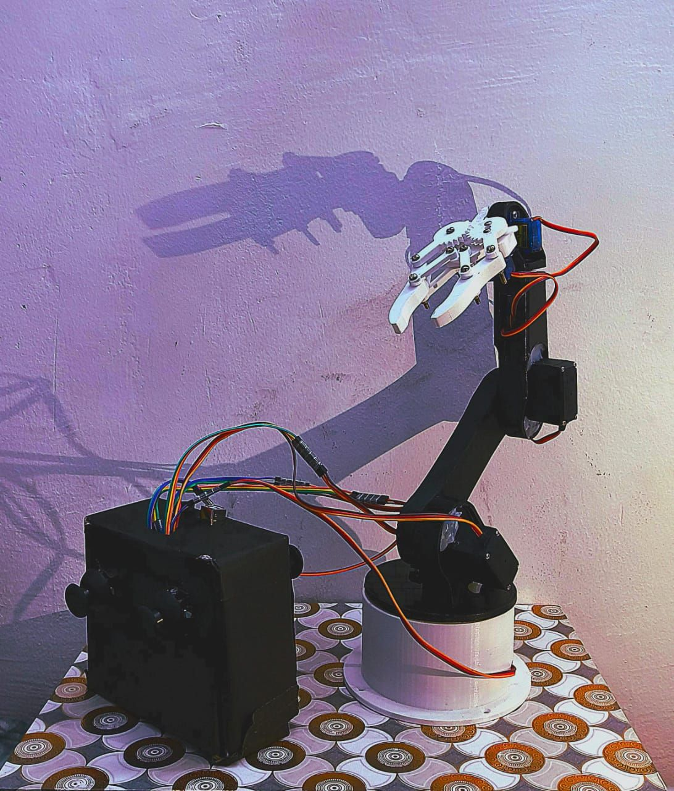

[](https://www.python.org/)
[](https://opencv.org/)
[](https://developers.google.com/mediapipe)
[](https://www.arduino.cc/)
[](https://nodejs.org/)
<!-- [](https://developer.mozilla.org/docs/Web/API/WebSockets_API) -->

# 6 DOF Robotic Arm Control System

A comprehensive robotic arm control system featuring multiple input methods including gesture recognition, joystick control, automated pick-and-place operations, and web-based remote control.
website link : https://robotic-arm-relay.onrender.com

## Features

- **6 Degrees of Freedom (DOF)**: Full control over base rotation, shoulder, elbow, wrist roll, wrist pitch, and wrist yaw
- **Multiple Control Methods**:
  - Gesture control using computer vision (MediaPipe)
  - Joystick control with analog inputs
  - Automated pick-and-place with inverse kinematics
  - Web-based control via WebSocket relay
- **Computer Vision Integration**: ArUco marker pose estimation for object tracking
- **Real-time Communication**: Serial and WebSocket communication protocols
- **Modular Design**: Separate firmware and software for different control modes



## Project Structure

```
Robotic_Arm/
├── Gesture_control/
│   ├── robo_gesture.py              # Python script for gesture-based control
│   └── Esp_firmware/
│       └── robo_arm_keyboard/
│           └── robo_arm_keyboard.ino # ESP32 firmware for gesture control
├── Joystick_control/
│   └── robotic_arm_joystick_esp/
│       └── robotic_arm_joystick_esp.ino # ESP32 firmware for joystick control
├── Pick_And_Place/
│   ├── camera_calibration.py        # Camera calibration script
│   ├── pick_and_place.py            # Main pick-and-place script with IK
│   ├── pnp_forward_kinematics.py    # Alternative pick-and-place with presets
│   ├── Pose_estimation.py           # ArUco marker pose estimation
│   ├── pnp.txt                      # Notes on angle presets
│   ├── tempCodeRunnerFile.py        # Temporary test file
│   ├── testing-function.py          # Testing utilities
│   └── pnp_esp_code/
│       └── pnp_esp_code.ino         # ESP32 firmware for pick-and-place
└── Web_control/
    ├── package.json                 # Node.js dependencies
    ├── robotic_arm_ui.html          # Web-based control interface
    ├── server.js                    # WebSocket relay server
    └── Esp_firmware/
        └── esp_firmware_robo_arm.ino # ESP32 firmware for web control
```

## Hardware Requirements

- ESP32 microcontroller (x2 - one for each control mode)
- 6x Servo motors (MG996R or similar, capable of 0-180° rotation)
- Webcam (for gesture control and pose estimation)
- Analog joysticks (for joystick control)
- Robotic arm frame with appropriate mounting
- Power supply for servos (typically 5-6V)
- ArUco markers (for pose estimation)


## Software Requirements

### Python Dependencies
```
opencv-python
mediapipe
pyserial
numpy
scipy
```

### Arduino Libraries
- ESP32Servo
- WebSockets (for web control)
- ArduinoJson (for web control)

### Node.js Dependencies
```
ws
```

## Installation and Setup

### 1. Gesture Control Setup

1. Install Python dependencies:
```bash
pip install opencv-python mediapipe pyserial numpy
```

2. Upload `robo_arm_keyboard.ino` to ESP32
3. Run the Python script:
```bash
python robo_gesture.py
```

### 2. Joystick Control Setup

1. Connect analog joysticks to ESP32 pins (25,26,34,35,32,33)
2. Upload `robotic_arm_joystick_esp.ino` to ESP32
3. Power on the system - control is automatic

### 3. Pick-and-Place Setup

#### Option A: Inverse Kinematics
1. Install Python dependencies (same as gesture control)
2. Upload `pnp_esp_code.ino` to ESP32
3. Run the script:
```bash
python pick_and_place.py
```

#### Option B: Preset Angles
1. Upload `pnp_esp_code.ino` to ESP32
2. Run the script:
```bash
python pnp_forward_kinematics.py
```

#### Camera Calibration (Optional)
```bash
python camera_calibration.py
```

#### Pose Estimation
```bash
python Pose_estimation.py
```

### 4. Web Control Setup

1. Install Node.js dependencies:
```bash
cd Web_control
npm install
```

2. Update WiFi credentials in `esp_firmware_robo_arm.ino`
3. Update WebSocket relay URL in both `server.js` and `esp_firmware_robo_arm.ino`
4. Upload ESP32 firmware
5. Start the server:
```bash
npm start
```

6. Open `http://localhost:8080` in your browser

## Usage

### Gesture Control
- Show 1-5 fingers to control different joints
- Hand position (left/right) determines direction (+/-)
- Fist gesture controls gripper

### Joystick Control
- Move joysticks to control corresponding joints
- Automatic deadzone handling prevents jitter

### Pick-and-Place
- Enter X,Y coordinates for target position
- System calculates inverse kinematics or uses presets
- Automatic pick-and-place sequence execution

### Web Control
- Connect to the WebSocket relay
- Use sliders to control joint angles
- Save/load presets
- Real-time status feedback

## Configuration

### Serial Communication
- Baud rate: 115200
- Default COM port: COM4 (Windows) - update in scripts as needed

### Robotic Arm Dimensions (Pick-and-Place)
- L1 (base to shoulder): 10.0 cm
- L2 (shoulder to elbow): 13.0 cm
- L3 (elbow to wrist): 10.0 cm

### Servo Limits
- Base: 0-180°
- Shoulder: 40-170°
- Elbow: 0-180°
- Wrist: 0-160°

## Troubleshooting

### Common Issues

1. **Serial Connection Failed**
   - Check COM port in device manager
   - Ensure ESP32 is properly connected
   - Verify baud rate matches

2. **Servo Not Moving**
   - Check power supply voltage
   - Verify servo pin connections
   - Ensure servo limits are not exceeded

3. **WebSocket Connection Failed**
   - Check WiFi credentials
   - Verify relay server URL
   - Check firewall settings

4. **Camera Not Detected**
   - Try different camera index in scripts
   - Check camera permissions
   - Ensure OpenCV installation

### Debug Mode
Enable serial output on ESP32 for debugging:
```cpp
Serial.begin(115200);
Serial.println("Debug message");
```

## Contributing

1. Fork the repository
2. Create a feature branch
3. Make your changes
4. Test thoroughly
5. Submit a pull request

## License

MIT License - see LICENSE file for details

## Acknowledgments

- OpenCV for computer vision
- MediaPipe for gesture recognition
- ESP32 community for hardware support
- WebSocket libraries for real-time communication</content>
<parameter name="filePath">c:\Users\ISHAN\OneDrive\Desktop\OLD_desktop_files\Robotic_Arm\README.md
